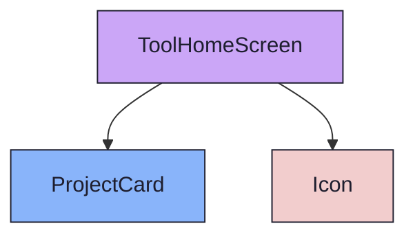

{/* ToolHomeScreen — Narrativ-Wahrheit. Norm: docs/doc-mdx-Norm.md. Basis: docs/ToolHome-Spec.md. */}
import { Meta, Canvas } from '@storybook/addon-docs/blocks'
import * as Stories from './ToolHomeScreen.stories.jsx'

<Meta of={Stories} />

## Kurzbeschreibung

Globaler Lobby-Screen ohne Projektkontext. Zeigt alle aktiven Projekte als Grid mit `ProjectCard`-Kacheln. Einstieg via `/ → /home` oder direkter Navigation.

## Zweck

ToolHome ist der _globale_ Einstiegspunkt des Developer Dashboards — kein Project-Home (`/:slug/home`). Auf dieser Seite wählt der Nutzer ein Projekt aus; danach wechselt die Shell in den projekt-spezifischen Modus (NavigationRail mit home/roadmap/backlog/memories).

**Typischer Flow:**

1. Nutzer öffnet DevDash → `/ → /home`
2. Sieht Projektliste als Grid
3. Klickt auf Projekt → `projectStore` gesetzt + Navigate `/:slug/home`
4. NavigationRail wechselt in Projekt-Modus

## Zustände

| State | Trigger | Darstellung |
|-------|---------|-------------|
| Loading | Fetch läuft (Mount) | 3× Skeleton-Card, `aria-busy="true"` auf Grid |
| Populated | Fetch OK, Projekte vorhanden | ProjectGrid mit N Cards + AddProjectCard |
| Empty | Fetch OK, keine Projekte | EmptyState + CTA „Erstes Projekt anlegen" |
| Error | Fetch fehlgeschlagen | Error-Banner (`role="alert"`, inline) |

<Canvas of={Stories.Default} />
<Canvas of={Stories.Loading} />
<Canvas of={Stories.Empty} />
<Canvas of={Stories.EinProjekt} />

## NavigationRail — globaler Modus (D06)

Auf `/home` ist kein Projekt aktiv → `AppShellFrame` übergibt `items=[]`. Die projekt-spezifischen Rail-Items (home/roadmap/backlog/memories) sind **ausgeblendet**, nur `RAIL_FOOT_ITEMS` (Einstellungen) bleibt sichtbar. Breadcrumb zeigt „DevDash" ohne View-Label.

## Connected (Daten-Integration)

`ToolHome` (`src/screens/ToolHome/ToolHome.jsx`) fetcht `GET /api/projects` (apiClient appended `?fields=full` automatisch). Response enthält `sprint_count`, `backlog_count`, `active_sprint`, `archived`. Client-Filter: `archived === 0`.

Bei Selektion: `setActiveProjectId(project.id)` + `setActiveSlug(project.slug)` → `navigate('/:slug/home')`.

## Offene Fragen

| Code | Frage | Status |
|------|-------|--------|
| Q01 | Archivierte Projekte: Toggle erwünscht? Aktuell client-seitig per `archived === 0` immer ausgeblendet. | 🟣 Offen |

## Barrierefreiheit

- Jede `ProjectCard` ist vollständig `<button>` — kein `div + onClick`
- `AddProjectCard` hat `aria-label="Neues Projekt anlegen"`
- Grid Loading: `aria-busy="true"` auf Grid-Container
- Error-Banner: `role="alert"` für Screenreader-Ankündigung
- Fokus-Reihenfolge: Header → Cards (links→rechts) → AddProjectCard → Rail-Footer

## Abhängigkeiten (Komposition)

{/* AUTOGEN:composition START */}

{/* AUTOGEN:composition END */}

## data-ui-Anker

| Anker | Element | Zweck |
|-------|---------|-------|
| `screen.toolHome` | `
` | Root |
| `screen.toolHome.header` | `
` | Titel-Zeile |
| `screen.toolHome.error` | `
` | Error-Banner |
| `screen.toolHome.grid` | `
` | Projekt-Grid (populated + loading) |
| `screen.toolHome.card-{slug}` | `ProjectCard` | Einzelne Karte |
| `screen.toolHome.add` | `AddProjectCard` | CTA-Karte |
| `screen.toolHome.empty` | `
` | EmptyState |
| `screen.toolHome.skeleton-{1-3}` | `
` | Skeleton-Cards (Loading) |
